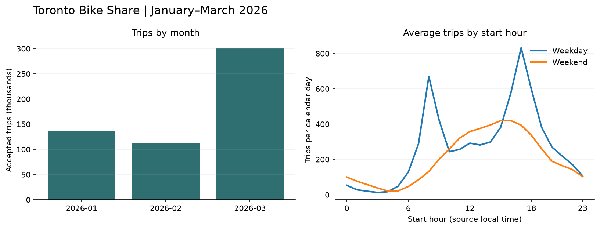

# Toronto Bike Share Operations Warehouse

An analysis of Toronto Bike Share trips from January–March 2026. The main questions are
when people ride, which stations are busiest, and which stations see more departures
than arrivals during the morning.

Python loads the source ZIP into DuckDB. Five dbt models clean the trips and build
station, daily ridership and hourly activity tables. A Streamlit dashboard lets you
filter by date, rider category and bike model.



## A few results

- The cleaned data has **550,146 trips** across **1,025 station IDs**. The median trip
  lasted **9.72 minutes**.
- March had **300,940 trips**, compared with **136,925** in January and **112,281** in
  February. This quarter alone cannot explain the difference or show a yearly trend.
- Weekday trips peaked at **17:00**, with an average of **832.2 starts** in that hour
  per weekday, including holidays.

The [full results](reports/findings.md) include station comparisons and excluded records.

## Run locally

Tested with Python 3.14.7. From this folder:

```sh
python3 -m venv .venv
source .venv/bin/activate
python -m pip install -r requirements.txt
python run.py --check-rerun
python -m pytest -q
python -m streamlit run app.py
```

On Windows, use `python` instead of `python3` and activate with
`.venv\Scripts\activate`. The source ZIP is included, so the build works offline after
installing dependencies. Stop Streamlit before rebuilding to avoid database file locks.

`run.py` creates `warehouse/bike_share.duckdb`, runs 15 dbt checks and writes the reports.
The `--check-rerun` option loads everything twice and compares table counts and row hashes.

## Publish the dashboard

In Streamlit Community Cloud, connect this GitHub repository and set the main file path
to `toronto_bike_share/app.py`. The first visit builds the database from the included ZIP
and runs the dbt checks. Later visits reuse it. A restart may need to rebuild it; no data
download or credentials are needed. DuckDB is limited to one thread and 256 MB while
loading and building the models to leave room for the dashboard on a small server.

## Cleaning choices

The source has **552,073 records**; **1,927** are excluded. Every record stays in
`stg_trips`, with a reason if rejected. Missing station IDs, invalid timestamps and
invalid durations account for most exclusions. Identical duplicate trips keep their
first row; conflicting duplicate IDs are excluded.

Duration must match elapsed timestamps within one second. The source has no UTC offsets,
so daylight-saving changes can cause unresolved timestamp mismatches. These rows are
excluded. Trips over four hours are flagged but kept. Station names use the latest nonempty name in this snapshot.

See the [data dictionary](docs/data_dictionary.md) for table definitions and
[build notes](docs/decisions.md) for the reasoning behind these choices.

## Limits and next step

These are winter trips. Net departures (departures minus arrivals) cannot tell us whether
a station ran out of bikes or how much demand went unmet. Date filters select trips by
start date; arrivals can fall into April. Trips starting before January are not included.

A useful extension would be adding station-availability snapshots to check whether large
morning net departures coincide with low bike availability.

## Data source

[City of Toronto / Toronto Parking Authority: Bike Share Toronto Ridership Data](https://open.toronto.ca/dataset/bike-share-toronto-ridership-data/).
The archive retrieved October 8, 2026 contains January–March only. Its URL and checksums
are saved in `data/provenance.json`; [references](docs/references.md) include the tool documentation.

Contains information licensed under the [Open Government Licence – Toronto](https://www.toronto.ca/city-government/data-research-maps/open-data/open-data-licence/).
The City has not endorsed this project.
